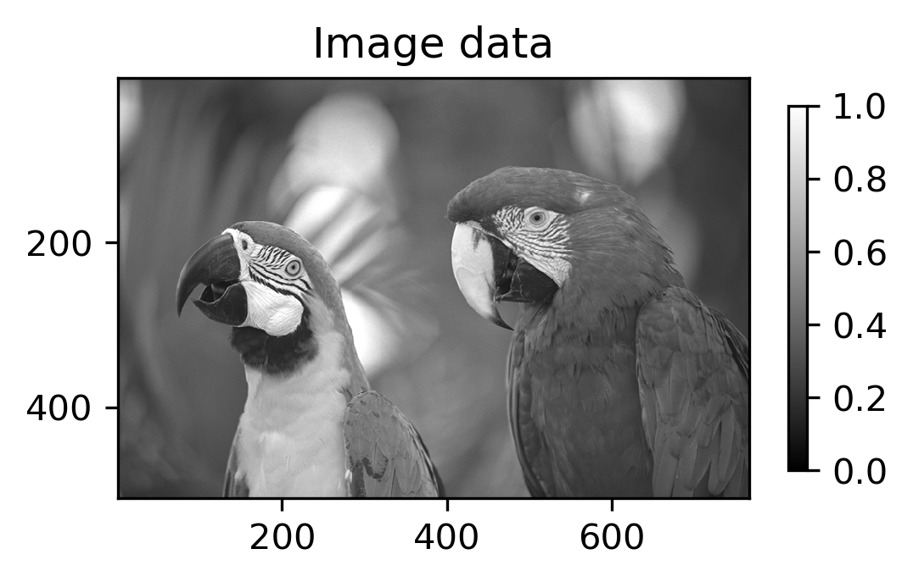
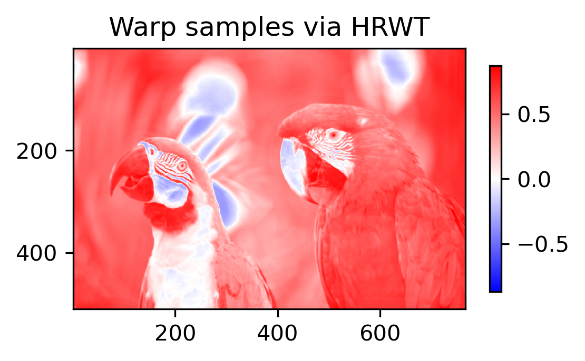
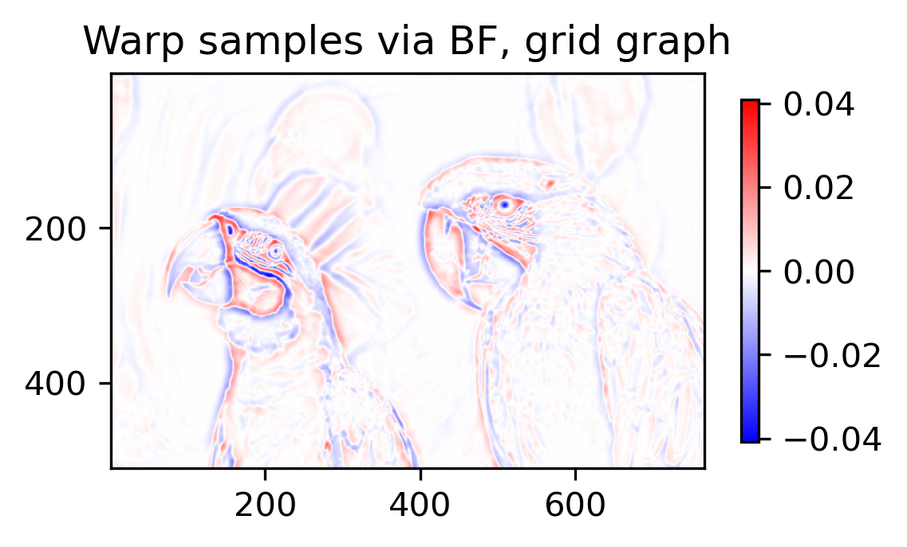

```@meta
EditURL = "../../../examples/compare_warpmaps.jl"
```

In this demo, we create warp maps from 1) the Higher-order Riesz-wavelet transform, and 2) the Bernstein filtering (BF) method on an unit grid graph.

# Setup
Install dependencies

````julia
import Pkg
let
    pkgs = ["LazyGPR", "PythonPlot", "VisualizationBag", "Images", "SpatialGSP"]
    for pkg in pkgs
        if Base.find_package(pkg) === nothing
            Pkg.add(pkg)
        end
    end
end;

import Random
Random.seed!(25)

using LinearAlgebra
using StaticArrays

import LocalFilters
import Images

import SpatialGSP as GSP
import RieszDSP as RZ
import LazyGPR as LGP

import VisualizationBag as VIZ

import PythonPlot as PLT
PLT.close("all")
fig_num = 1

const T = Float64
const D = 2;
````

The following helper scripts can be found in `examples/helpers/` from the root repository folder.

````julia
include("helpers/utils.jl")
include("helpers/image.jl")
````

````
load_kodak_region (generic function with 1 method)
````

# User inputs

````julia
#where the results are saved.
save_results_dir = "output/"
if !ispath(save_results_dir)
    mkpath(save_results_dir)
end

#pics_folder = joinpath(homedir(), "work/data/images/kodak/")
pics_folder = "data/"
image_path = joinpath(pics_folder, "kodim23.png")

img = loadkodakimage(T, image_path; discard_pixels = 1)
x_nD, x_ranges = image2samples(img)
sz_x = size(x_nD);
````

The positions for each pixels. This is a grid, so we represent it as a tuple of range data types.

````julia
Xrs = (1:size(x_nD,1), 1:size(x_nD,2))
im_y = x_nD;
````

# Construct Warp Samples
Warp samples from RieszDSP.jl

````julia
W_rz = LGP.create_grid_warp_samples(LGP.UseRieszDSP(RZ), im_y)
σr = 0.5
σs = 1.0
W_rz = LocalFilters.bilateralfilter(
    W_rz, σr, σs, 2*round(Int,3*σs)+1,
);
````

Bernstein filtering, grid graph.

````julia
warp_config = GSP.WarpConfig{T}()
W_grid = LGP.create_grid_warp_samples(
    LGP.UseSpatialGSP(GSP),
    im_y,
    warp_config,
);
W_grid = LocalFilters.bilateralfilter(
    W_grid, σr, σs, 2*round(Int,3*σs)+1,
);
````

# Compare Warp Samples

````julia
fig_size = VIZ.getaspectratio(size(im_y)) .* 4
dpi = 300;
````

Input image.

````julia
fig_num = VIZ.plotmeshgrid2D(
    PLT,
    collect(Xrs),
    im_y,
    [],
    "x",
    fig_num,
    "Image data";
    cmap = "gray",
    vmin = 0,
    vmax = 1,
    horizontal_title = "",
    vertical_title = "",
    matrix_mode = true,
    color_bar_shrink = 0.7,
    fig_size =fig_size = fig_size,
    dpi = dpi,
)
PLT.gcf()
````


Warp samples using the Higher-order Riesz-wavelet transform.

````julia
fig_num = VIZ.plotmeshgrid2D(
    PLT,
    collect(Xrs),
    W_rz,
    [],
    "x",
    fig_num,
    "Warp samples via HRWT";
    cmap = "bwr",
    symmetric_color_range = true,
    horizontal_title = "",
    vertical_title = "",
    matrix_mode = true,
    color_bar_shrink = 0.7,
    fig_size = fig_size,
    dpi = dpi,
)
PLT.gcf()
````


Warp samples from Bernstein filtering. unit grid graph.

````julia
fig_num = VIZ.plotmeshgrid2D(
    PLT,
    collect(Xrs),
    W_grid,
    [],
    "x",
    fig_num,
    "Warp samples via BF, grid graph";
    cmap = "bwr",
    symmetric_color_range = true,
    horizontal_title = "",
    vertical_title = "",
    matrix_mode = true,
    color_bar_shrink = 0.7,
    fig_size = fig_size,
    dpi = dpi,
)
PLT.gcf()
````


---

*This page was generated using [Literate.jl](https://github.com/fredrikekre/Literate.jl).*

