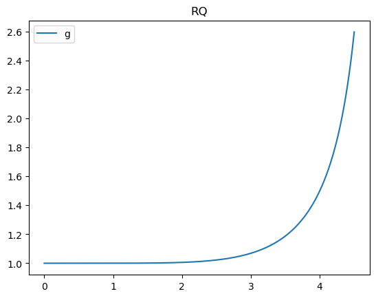

```@meta
EditURL = "../../../examples/s_map.jl"
```

In this demo, we visualize the variance adjustment map curve, ξ, looks like. You can use this type of visualization to choose the tuning parameters `L`, `x0`, and `y0` for the adjustment map.

# Setup
Install dependencies

````julia
import Pkg
let
    pkgs = ["LazyGPR", "PythonPlot", "VisualizationBag", "Images", "SpatialGSP"]
    for pkg in pkgs
        if Base.find_package(pkg) === nothing
            Pkg.add(pkg)
        end
    end
end;

using LinearAlgebra
import Random
Random.seed!(25)

import LazyGPR as LGP

import PythonPlot as PLT
PLT.close("all")
fig_num = 1

const T = Float64;
````

# User Inputs

````julia
b_x = convert(T, 5) # the neighborhood radius.
M = floor(Int, b_x)
````

````
5
````

The exponent `L` must be an even positive integer. The larger the flatter.

````julia
L = M # We made an arbitrary choice here, as this is a tuning parameter. Feel free to try another positive even integer.
if isodd(L)
    L = L + 1
end
````

````
6
````

We specify a point that the curve must pass through. This point is a tuning parameter; feel free to try another point.

````julia
x0, y0 = convert(T, 0.8*M), 1 + convert(T, 0.5)
````

````
(4.0, 1.5)
````

# Visualize Adjustment Map
Construct the adjustment map container.

````julia
s = LGP.AdjustmentMap(x0, y0, b_x, L)
@assert s.a > 0 # try a different (x0, y0) if s.a is negative or too small.
````

Specify the plotting area.

````julia
viz_bound = 0.9 # this is a number between 0 and 1 that controls the plot's domain. closer to 1 means the plot will tend closer to infinity near the upper boundary of the plot.
u_range = LinRange(0, viz_bound*M, 1000)
````

````
1000-element LinRange{Float64, Int64}:
 0.0, 0.0045045, 0.00900901, 0.0135135, …, 4.48649, 4.49099, 4.4955, 4.5
````

Setup the ξ curve.

````julia
ξ = uu->LGP.evalsmap(uu, s)
@assert abs(ξ(x0)-y0) < eps(T)*100 # see if g passes through the point (x0,y0).
````

Plot.

````julia
PLT.figure(fig_num)
fig_num += 1

PLT.plot(u_range, ξ.(u_range), label = "g")

PLT.legend()
PLT.title("RQ")
PLT.gcf()
````


---

*This page was generated using [Literate.jl](https://github.com/fredrikekre/Literate.jl).*

